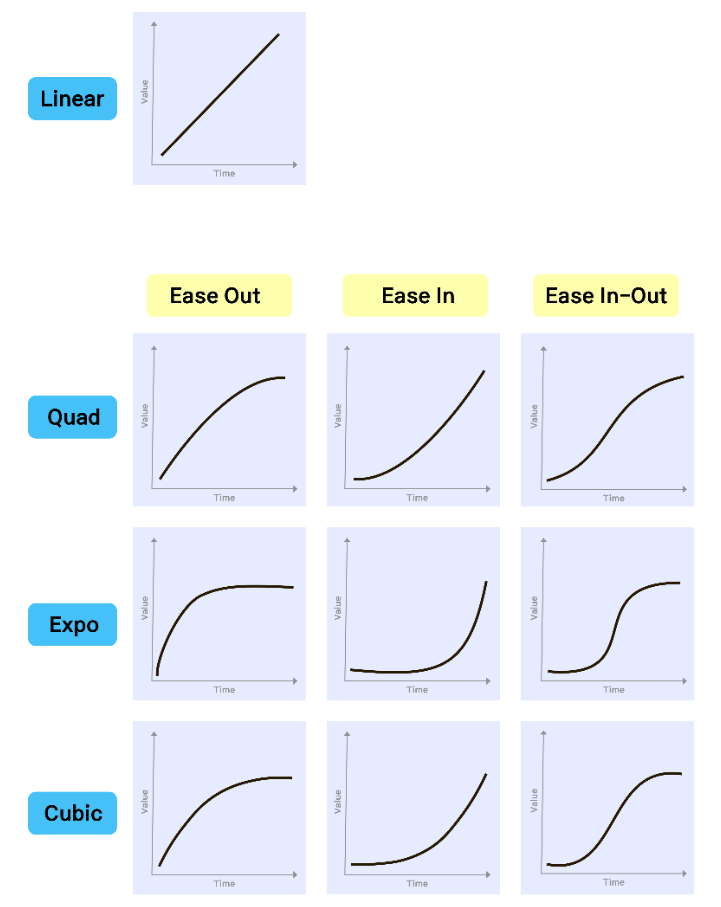
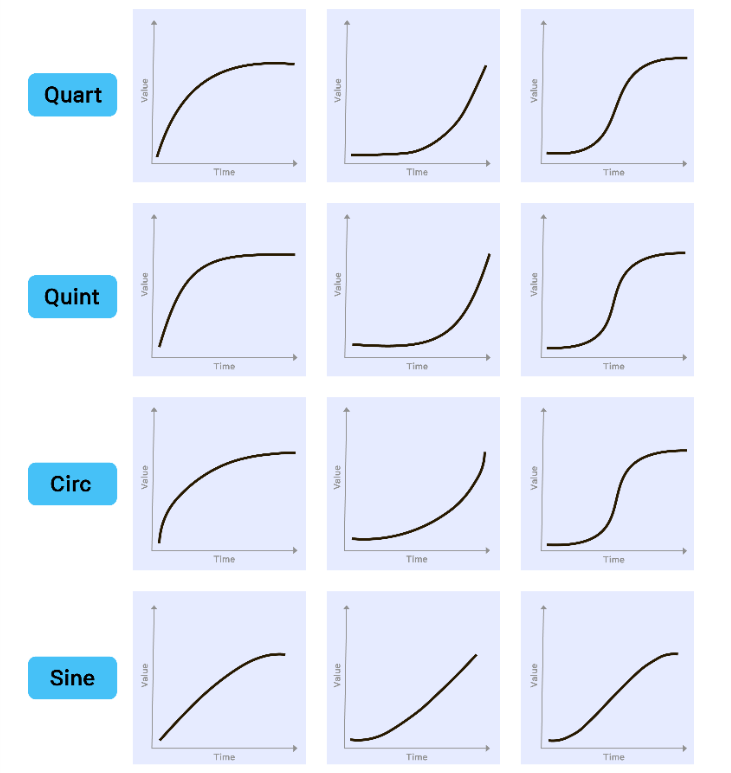
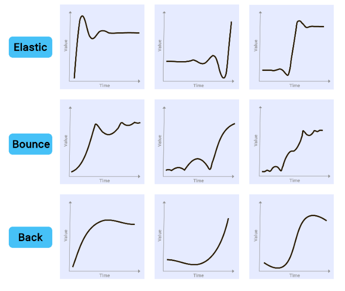
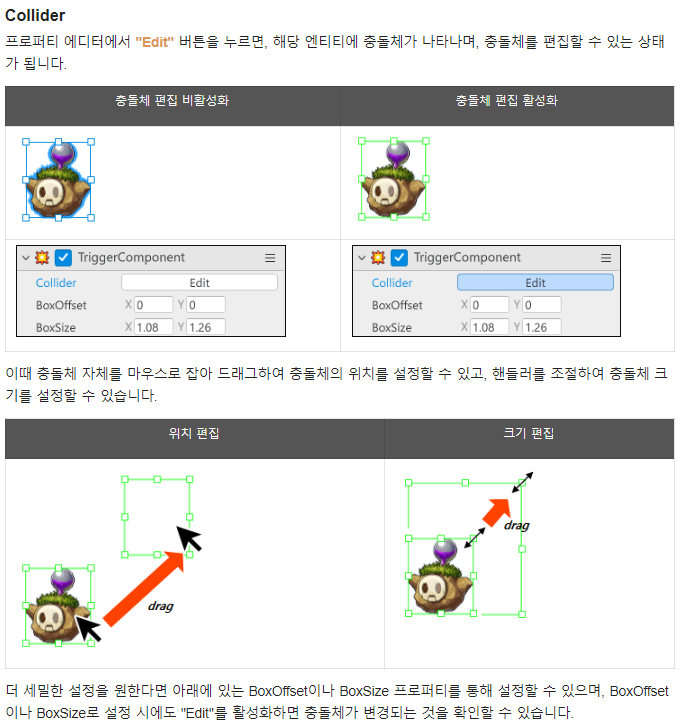
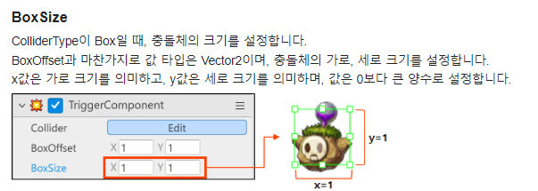
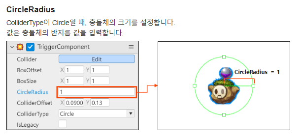
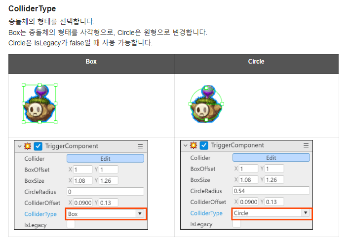
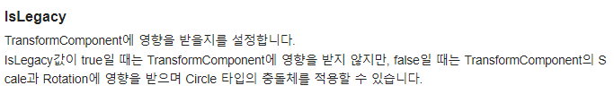

# 2주차

 
# Resources

 
## 기본 컴포넌트의 이해
- 자세한 사항들은 개발자의 API Reference에서 살펴볼 수 있다.
- 자주쓰는 Component는 별도의 영상
- 특수하고 자주쓰는 Component
- Transform Component: 거의 모든 엔티티에 쓰인다.
<ol>

+ 특수한 형태를 제외하고는 대부분의 엔티티에 쓰인다.
+ 위치정보를 가지고 있다.
+ Position: 어떠한 좌표를 가지는지. 실제로 x,y,z의 값이라 보면 된다. 값을 바꾸면 위치가 이동함
+ Scale: 이 물체의 크기를 나타낸다. (비율) 1이 기본값. x의 값을 2배로 하면 가로로 2배로 늘어난다.
+ Rotation: 회전값 대부분의 수직게임에서는 z축으로 회전된다. (시계,반시계 방향 등. 단위는 degree( ˚ )
+ 매우 자주 사용하고, 아주 중요한 Component
+ 만약 부모-자식 엔티티로 될 경우, 자식 엔티티는 부모 엔티티의 상대좌표로 Position이 설정 된다. (상대좌표)
+ WorldPosition: 위 같은 경우, WolrdPosition은 World 기준의 좌표이다. (절대좌표)
+ Rotation도 마찬가지. 그냥 Rotation은 부모기준 상대좌표, World Rotation은 World 기준 절대좌표
</ol>

- SpriteRendererComponent: '무엇'을 그릴것인가. 어떤 이미지를 그릴것인가를 표시해주는것. 어떤걸 어떻게 표시할지, 그려질지 나타내는 Component. Transform과는 다르게 없을 수 있음.
<ol>

+ SpriteRUID: 이 값이 해당 이미지를 상징하는 값이라고 생각하면 된다.
+ 외부의 이미지도 import하면 RUID가 발급이된다.
+ 기본적으로 이미지이지만, 애니메이션도 포함되는 ID이다.
+ PlayRate: 애니메이션의 속도를 지정 가능.
+ StartFrameIndex, EndFrameIndex: 애니메이션이 연속적으로 나오는 이미지들인데, 이것들을 몇번부터 몇번까지만 재생하는지 설정하는것.  
인덱스 이상의 값 설정시, 가지고 있는 인덱스까지만 실행한다.
+ FlipX, FlipY: X축 반전, Y축 반전 (이미지 클릭시 나오는 점을 기준으로 반전)
+ Layer: 2D게임이므로 이미지의 앞,뒤 순서를 뜻함. 다음강의에서 진행
+ Color: 색을 입하는것.
+ DrawMode: 기본적으로 Simple. Tile로 변경시 TileSize를 통해 사이즈 지정 가능.
+ TileSize: X와 Y의 값만큼 늘려준다. 
</ol>

## 지형과 레이어의 이해
- MOD에서 구성하는 방법은 메이플스토리에서 구성하는 방식과 동일함.
- 직사각형의 그리드가 있다.  
 그리드의 교점: 작은 크기의 타일  
 그리드의 중점: 큰 크기의 타일  
 사각형 타일들의 대각선을 클릭하면 대각선의 지형을 만들 수 있다.
- World/maps/map01/TileMap 엔티티가 있다.  
클릭시 타일맵 Property가 나오고, TileMapComponent가 나온다.
- TileMapComponent
<ol>

+ Color: 타일의 색상 정할 수 있다.
+ TileSetRuID: Sprite Picker에서 다른 타일들로 바꿀 수 있다.
+ ooLayer: 이미지의 앞,뒤 순서를 정한다.
</ol>

- FootHold: 캐릭터, 몬스터들이 밟는 발판 정보
<ol>

+ 좌측상단 File/Setting/만들기/발판 정보 체크 -> Scene안에서 발판정보 확인 가능하다.
+ FootHold Model에 포함된 FootHold들은 수정이 가능하다. 추가/삭제도 가능.
+ Property에서도 수정가능하다.   CustomFootholdComponet에서  
size: 각 Foothold Point의 갯수  
목차를 열어보면 각 풋홀드의 포인트들의 좌표를 설정할 수 있다.
+ FootHoldDrag: Tilemap의 마찰력
+ FootHoldForce: Tilemap이 플레이어에 가하는 힘
+ FootHoldWalk: Tilemap 위에 있을때의 속력
</ol>

- MapLayer: 다른 Tile들을 쓸수있는 Map들의 Layer
<ol>

+ 하나의 맵에는 최대 10개의 Layer 추가 가능. 
+ Layer1에 구성하고있는 Entity를 Layer2로 옮기고 싶다면, 그 Entity의 Property->SpriteRendererComponent->SortingLayer에서 원하는 Layer로 변경한다.
+ Layer에서 가장 위에 위치한 Layer가 가장 앞에 위치한다.
</ol>

## 자주 사용하는 컴포넌트
- TweenLineComponent
<ol>

+ Model이 이동하는 Component
+ TweenType: 등속운동인지, 가속운동인지, 등가속운동인지 등등을 설정해준다.
+ SyncType (동기화 방식): Server는 여러 클라이언트에서도 동일하게 움직인다. Client는 시간이 안맞을 가능성이 높다.  
동기화가 되는 객체가 충돌이 발생하거나, 타거나 하는 것들은 Server로 설정을 해주어야한다.
</ol>

- TweenCirculerComponent, TweenFloating Component
<ol>

+ 기본적으로 TwwenLineComponent와 동작 과정이 비슷하고, Circular는 원형운동 Floating은 상하운동이 동작한다.
</ol>

+ RigidbodyComponent
<ol>

+ 강체(형태가 변하지 않는 (고체 등)) 물체들의 물리 운동들을 컨트롤 하는것.
+ 플레이를 했을때 낙하법칙에 의해 떨어지는 효과 등
+ IsBlockVertical: 세로 지형은 무조건 Block 되는것.
+ IsQuaterView: 지형이 없을때 떨어지는게 아니라, 공중을 날듯 자유롭게 이동 가능하게 한다. (3D 입체의 배경에서는 자유롭게 움직이는것처럼 보인다.)  
QuaterView() 에서는 가속도 등 자유롭게 설정 가능.
</ol>

- MovementCoponent
<ol>

+ InputSpeed: 해당 Model의 Speed값 조정 가능.
+ JumpForce: 해당 Model의 Jump값 조정 가능.
</ol>

- TriggerComponent: 객체간에 충돌이 있을때 알려주는 Component
<ol>

+ ColliderOffset: 캐릭터의 박스 사이즈를 변경할 수 있다.
+ 물리적인 특성이 없으므로 바로 Event가 일어나지 않지만, Script에서 받아서 설정해주면 발생한다.
</ol>

- PlayerComponent:
<ol>

+ 플레이어들의 MaxHp, PVPMode 설정 가능하다.
</ol>
   
   

 
# Docs

## ch03
### 엔티티의 위치, 크기, 회전 조정
- 엔티티를 변형하는 방법은 TransformComponent의 프로퍼티 값을 변경하거나, 엔티티를 선택하여 드래그 or 핸들러를 이용한다.
- 위치를 변경하는 방법은 TransformComponent에서 Position의 X,Y값을 변경한다.  
혹은 엔티티를 선택하여 원하는 위치로 이동시킨다.
- Transform Component 함수의 활용
<ol>

+ Translate 함수  
  
+ Rotate 함수 
</ol>

### 스프라이트 색상 조정
- 스프라이트의 색상을 조정할 수 있다.
- Sprite: 2D 이미지를 스프라이트라 칭합니다. 스프라이트는 위치, 크기, 회전 등을 변경할 수 있다.  
스프라이트는 고유한 RUID값이 있고, 이 값을 이용해 간편하게 빈 모델에 스프라이트를 넣거나 변경할 수 있다.  

- 웹에 있는 이미지의 URL을 이용하여 Web Sprite로 사용할 수 있다. 단, 직접 제작한 이미지나 MOD가 제공하는 리소스가 아닌 경우 사용이 가능한지와 활용 범위를 반드시 확인해야 한다.  

- 스프라이트 색상 조정: SpriteRendererComponent와 WebSpriteComponent의 Color Property에서 이미지의 색, 명도, 채도, 투명도를 조정할 수 있습니다.
  

## ch04
### 발판 만들기
- Foothold 모델로 발판 만들기    

- 새로운 발판 만들기
<ol>

Foothold에 원하는 모델이 없을 때, 직접 새로운 풋홀드를 만들 수 있습니다. 워크스페이스에서 Foothold로 검색하면 두 개의 컴포넌트를 볼 수 있습니다. 두 컴포넌트 모두 Foothold와 관련되어 있지만, 개념과 용도가 다릅니다. 새로운 발판을 만들 때는 CustomFootholdComponent를 사용해야합니다.
+ FootholdComponent: 맵 전체의 발판 정보를 저장, 제공하는 컴포넌트입니다. 프로퍼티 에디터 창에서 검색 시 값은 나오나 이용할 수 없습니다.
+ CustomFootholdComponent: 발판을 만들고 조정하는 컴포넌트입니다. Foothold 모델에 이 컴포넌트가 포함되어 있습니다.
</ol>

- Custom Foothold Component 활용
<ol>

+ 발판 경로 그리기  

+ 발판에 속성 부여하기  

</ol>

### 맵 레이어
- 맵 레이어를 사용해 입체적으로 게임 화면을 디자인 할 수 있다.
- 맵 레이어 위치  

- 맵 레이어 이해하기
<ol>

+ 레이어란 맵 화면 위에 올리는 투명한 판과 같다.
+ 판 위에 여러 엔티티를 올리고, 또 다른 투명한 판을 올리면 새로운 엔티티를 배치할 수 있습니다.
+ 레이어 창 가장 아래에 깔린 레이어가 맵 화면에서 가장 뒤에 위치하게 되고, 맨 위에 있는 레이어가 가장 앞에 배치됩니다.
+ 레이어에 배치된 엔티티들은 레이어 순서에 일괄적으로 영향을 받습니다. 가장 아래 있던 레이어를 위로 올리는 순간, 엔티티의 순서가 함께 변경됩니다.
</ol>

- 레이어 우선순위 적용 규칙  
메이커에서 엔티티는 아래 순서에 따라 결정됩니다.
<ol>

1. Map Layer (SpriteRendererComponent의 SortingLayer)
2. SpriteRendererComponent의 OrderInLayer Property  

3. Transform Component의 Position Z값
</ol>

- 맵 레이어와 플레이어 아바타 관계
<ol>

플레이어 아바타는 엔티티이지만, 다른 엔티티와 차별점이 있습니다.
플레이어 아바타는 메이커에서 맵에 배치할 수 없고, 특정 레이어에 귀속되지도 않습니다.
다른 엔티티는 움직임과 관계 없이 처음 배치된 맵 레이어에만 속하는 것과 다르게, 플레이어 아바타는 실시간으로 밟고 있는 엔티티(타일, 발판 등)가 속한 맵 레이어를 기준으로 소속을 끊임 없이 바꿉니다.
+ ex1)  

+ ex2)  

</ol>

## ch05
### 엔티티 구간 이동시키기
- TweenComponent  
TweenComponent를 이용하여 엔티티에 운동성을 만들고, 세부 설정을 조정할 수 있습니다.
- TweenFloatingComponent: 원점을 기준으로 부유 운동
<ol>

</ol>

- TweenLineComponent: 원점에서 목적지까지의 선형 운동
<ol>

</ol>

- TweenCircularComponent: 원점을 중심으로 원 운동
<ol>

</ol>

- 복수의 컴포넌트 적용시, 하나의 컴포넌트만 동작하거나 오작동하는 버그가 생길 수 있으므로 Tween COmponent중 하나만 사용할 것을 권장합니다.

- TweenType  
 일상에서 만나는 움직이는 사물 대부분이 속도를 시시각각 바꾸며 움직이기에 사람 눈에는 일정한 속도로 움직이는 로봇 같은 물체가 어색하게 보입니다. 유저가 움직이는 엔티티를 자연스럽게 느끼도록 하기 위해 엔티티의 운동 속도와 반동을 다르게 설정할 수 있습니다. MOD에서 지원하는 타입은 10가지이며, 각 3가지 변형이 있습니다.
<ol>

+ 종류: Quad, Expo, Cubic, Quart, Quint, Circ, Sine, Elastic, Bounce, Back
+ Ease Out: 빠르게 움직이기 시작해서 마지막에 감속하며 목적지에서 멈춥니다.
+ Ease In: 느리게 움직이기 시작하다 가속하며 목적지에서 멈춥니다.
+ Base In-Out: 느리게 움직이기 시작해 중간 구간에서 빠르게 움직이다, 감속하며 목적지에서 멈춥니다.  

  
  

</ol>

### 캐릭터 초기 속성 편집
- 플레이어 기본 속성
<ol>

+ Player에서 기본 속성을 변경할 수 있다.
1. Workspace에서 Player 선택
2. Player의 모델 프로퍼티 값 변경
3. 시작을 눌러 변경사항 확인.
+ Player Property  
  

</ol>

- Model Property 비활성화  

- DefaultPlayer의 기본 컴포넌트 삭제하기.
<ol>

기본 컴포넌트를 확장한 컴포넌트를 제작해 사용한다면, DefaultPlayer의 기본 컴포넌트를 삭제해야 합니다. 근본이 같은 컴포넌트가 여러 개 있으면 오동작 가능성이 커지기 때문에 기본적으로 하나의 컴포넌트만 사용하는 것을 권장한다.
+ 컴포넌트 특성에 따라 확장한 컴포넌트 여러 개를 함께 활용할 수도 있습니다.
+ 컴포넌트의 동작 방식이 각각 다르므로 비활성화만 하는 것은 권장하지 않습니다.
오동작 가능성은 낮지만, 스크립트 작성 중 컴포넌트 명이 헷갈리거나 작성한 대로 동작하지 않고 오류가 날 가능성이 있기 때문입니다.  

</ol>

### 엔티티의 충돌을 감지하는 TriggerComponent
- 물체의 충돌 이벤트 발생과 출동시 처리 방법
- 충돌은 충돌체를 포함하고 있는 엔티티의 충돌 영역이 서로 교차했을 때를 의미한다.
- 충돌체는 TriggerComponent 또는 HitComponent와 같은 컴포넌트를 엔티티에 추가하면 자동으로 생성됩니다.
- HitComponent는 피격의 범위. TriggerComponent는 충돌이 일어나는 범위를 설정할때에 충돌체를 사용합니다.
- ColliderOffset, BoxSize, CircleRadius등의 Property로 충돌체의 속성을 설정할 수 있다.

- 충돌체의 크기, 위치 편집
<ol>

세부적인 충돌체의 크기, 위치, 형태 등은 충돌체를 지닌 컴포넌트의 프로퍼티를 통해 설정할 수 있습니다.
- Collider  

- BoxOffset과 ColliderOffset  

- BoxSize  

-CircleRadius  

- ColliderType  

- IsLegacy  

</ol>

- TransformComponent의 Scale과 Rotation에 따른 충돌체 변화
<ol>

IsLegacy 프로퍼티가 false일 경우 충돌체는 TransformComponent의 Scale과 Rotation 값에 영향을 받습니다.
만일 Scale값이 커지면 충돌체의 크기도 함께 커지고, Rotation에 의해 엔티티가 회전하면 충돌체 역시 함께 회전합니다.
아래는 엔티티가 충돌을 감지했을 때 노란색으로 변화되는 예시로, Transform의 Scale 값과 Rotation 값이 변할 때마다 다른 엔티티와 충돌하여 노란색으로 변하는 것을 확인할 수 있습니다.
+ Transform.Scale 변화 예시  
https://youtu.be/4Ri0CpWg6RY
+ Transform.Rotation 변화 예시  
https://youtu.be/xox3H77CDNg

모든 엔티티는 계층구조로 구성되기 때문에 자식 엔티티의 TransformComponent는 항상 부모 엔티티의 TransformComponent에 영향을 받게 됩니다.
이 때문에 충돌체 역시 부모 엔티티의 TransformComponent에 영향을 받습니다. 예를 들어 아래와 같이 충돌체를 가진 4개의 엔티티를 자식으로 둔 부모 엔티티를 회전시키면, 자식 엔티티가 부모 엔티티를 따라 회전하며 다른 엔티티와의 충돌을 감지하는 것을 볼 수 있습니다.  
https://youtu.be/j2ijQUSA3Qg
</ol>

-TriggerComponent를 활용한 충돌 이벤트 발생시 액션 수행
<ol>

월드 상에 A와 B라는 엔티티가 있다고 가정해 봅시다.
A와 B에는 TriggerComponent가 추가되어 있어서 두 엔티티가 충돌하면 충돌 이벤트가 발생합니다. 하지만 충돌 이벤트만 발생했을 뿐, A와 B에는 어떤 변화도 발생하지 않습니다.
이유는 이벤트가 발생했을 때 어떤 처리도 추가하지 않았기 때문인데요, TriggerComponent를 활용하면 충돌 이벤트가 발생했을 때의 특정 액션을 추가할 수 있습니다.
예를 들면 A와 B가 충돌했을 때, A와 B의 HP를 깎는다던가, 혹은 A와 B중 하나를 없앤다던가 등의 처리를 할 수 있습니다.
+ Entity Event System을 이용한 충돌 시 액션 추가
<ol>

- 구조  

- 핸들러의 추가  

- 핸들러 Event  

- 충돌 이벤트 샌더 설정  

- 핸들러 구성  

</ol>

+ 확장 TriggerComponent를 활용한 충돌 처리
<ol>

+ TriggerComponent의 함수를 오버라이딩하여 충돌 처리를 추가하는 방법
+ 구조  

+ TriggerComponent 확장  

+ 함수 오버라이드  

+ 함수 종류  

+ 파라미터  

</ol>
</ol>