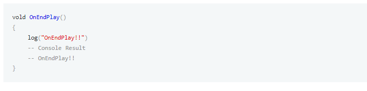
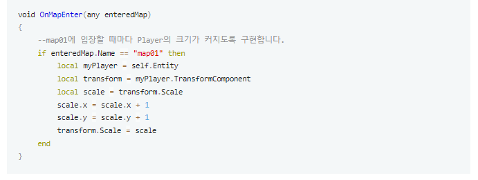
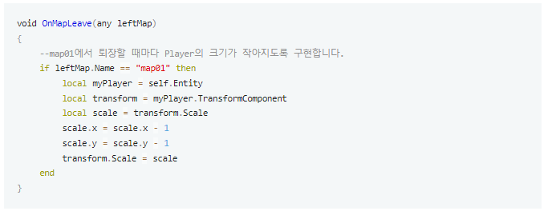

# 3주차

  

 
# Resources

 
### 스크립트의 이해
- 대부분의 Lua 문법을 다룬다. (Lua 문법 + 추가된 형태)
- Workspace->MyDesk에서 원하는 스크립트를 제작 후 사용한다.
- 반복문 사용
<ol>

*1부터 10까지 log 찍는 행위를 반복  
for count = 1, 10, 1 do 
<ol>
    log(count)
</ol>
end
</ol>

- 조건 분기문
<ol>

if 조건 then
<ol>

행동 
</ol>
end
</ol>

- Logic
<ol>

+ Logic은 World상에 딱 하나만 존재하기때문에, Log 함수를 실행할 때 로그가 나온다. 하지만 Component에서 출력하는 Log는 해당 Component를 쓰는 Entity가 있어야 한다.
</ol>

- Component
<ol>

+ Component는 Log를 출력하는 함수가 있을경우, 해당 Component를 가지고 있는 Entity수에 따라 출력된다.
</ol>

- function: 어떠한 기능들을 모아놓은 것.
<ol>

+ C언어의 함수와 다를바가 없다.
+ 기본적은 함수가 있다.
+ 주로 사용하는 함수는 OnBeginPlay, OnUpdate, OnEndPlay
+ 컴포넌트가 초기화될때 OnBeginPlay, 끝날때 OnEndPlay, 주기적으로 사용하는게 OnUpdate
+ 자기자신을 호출시엔 self. 사용
+ 자신의 Component 내의 함수 호출시엔 self:함수 사용
+ Component가 달려있는 Entity 접근방법:  
self.Entity.~~
+ 자신의 위치의 좌표를 받아오는 방법:  
local myEntityPosition = self.Entity.Transformcomponent.Position
+ 위치를 조작하는 방법 (1초에 1번씩 x좌표를 0.5증가)
<ol>  
for count=1, 5, 1 do  
<ol>

myEntityPosition.x = myEntityPosition.x + 0.5
wait(1)
</ol>
end

</ol>
</ol>

### 네트워크의 이해

- 동기화
<ol>

- MOD에선 기본적으로 1개의 Server와 다수의 Client가 있다.
- Entity를 생성시, Server에도 존재하고 Client에도 존재한다. (각각 하나씩 추가가 되는 개념)
- Server, 혹은 Client에서 값을 바꾸는데, 두개가 동시에 변하지 않는다면, 문제가 된다. 따라서 각각 바꾸게되면 서로의 값을 맞추는 작업을 한다.  
->이게 동기화
- MOD에서 Property는 동기화 옵션을 해준다.
- 변수 위에 [Sync] 라고 되어있으면 동기화, 클릭시 [None] 으로 바뀌는데 그러면 동기화X
- any, table 등, 동기화, 비동기화를 바꿀수 없는것도 존재.
- Server는 1개지만 Client는 여러개가 가능하다.
- Server에서 값을 바뀌면, Client의 값은 다 같이 바뀐다. (Server는 1개라서 권한을 가진다.)
- 반대의 상황에서는 안된다. => 동기화의 방향은 항상 단방향 (Server -> Client)
- OnSyncProperty라는 함수는, Client 기준으로만 작성을해서, 여기서 조작시에는 해당 Client에서만 적용이 된다.
</ol>

- Function의 공간, 실행제어
<ol>

+ 해당 함수가, Server와 Client 모두에서 실행 가능한데, 이것을 Server만 실행을 하는 함수인지, Client만 실행을 하게 하는 함수인지 정하는것.
+ 5가지: Server, Client, ServerOnly, Client Only, multicast
+ ServerOnly, ClientOnly: 각각 서버와 ,클라이언트에서만 실행할 수 있게 하는것.
+ Server, Client: 이 함수가 Server 혹은 Client에서 돌아가야한다.  
client는 func가 server에서 불리면, 자동으로 client쪽으로 패킷을 보내서 통신을 해서 client가 호출이 되게한다.  
server는 이 함수가 client에서 불렸다 하더라도, server에 보내서 실행하라.  
Multicast: client에도 보내고, server에도 보내는 것.
+ Timming이 있는데, server에서는 server순서대로 코드를 읽어나가는데, client에서 요청을 보내는 시간안에, server에서 다른것을 실행하면, 더 늦게 올 수 있다.  
1. log("begin play")
2. server() 
3. client()
4. log("end play")
+ 실행시
1. begin play
2. server()
3. end play
4. client
+ 순서대로 찍힌다. 따라서 타이밍 이슈가 있으므로, 언제 넘어가서 언제 넘어오는지 등 잘 고려해서 코딩해야함.
+ Client 내에서만 생성하고싶은 Entity가 있음 ex) UI, HP, 입력 등
+ 위와 같은것들은 "나"를 위한 것들이므로, Client에서만 관리를 한다.
+ Effect는 경우에 따라서, 서버에서 제어를 한다.  
근데, 특정 이펙트를 한 Client에서만 보이게 하고싶을때는 Local Entity를 사용한다.
+ 최적화할때, Client 쪽 logic를 사용한다.
+ 어쨋든 입력과 UI관련은 Client에서 제어를 한다.
</ol>

  
  

 
# Docs
 
 

## ch06

### 스크립트 에디터 오리엔테이션
- MOD는 스크립트 에디터를 사용하여 크리에이터가 원하는 컴포넌트나 로직을 만들 수 있습니다.
- 스크립트의 문법은 Lua Script를 사용하여 다양한 MOD API를 지원합니다.
- 스크립트 컴포넌트 추가  

- OnBeginPlay 함수
<ol>

+ 이 함수는 스크립트 컴포넌트가 실행될 때 처음에 한 번 불리는 함수이다.
</ol>

- log 함수
<ol>

+ log 함수는 스크립트 작성 시 가장 기본적이면서도 가장 자주 사용되는 함수 중 하나 입니다.
파라미터로 넘겨진 값을 메이커 하단 콘솔 창에 출력해줍니다.
변수나 프로퍼티 값, 또는 함수의 리턴 값들을 콘솔창에 출력하여 확인할 수 있습니다.
</ol>

- 작성한 Script Component 추가
<ol>

+ 스크립트 컴포넌트를 완성했더라도 실제 컴포넌트가 삽입된 엔티티가 없으면 스크립트가 실행되지 않습니다.
따라서 추가한 HelloMapleWorld 컴포넌트를 맵에 배치한 엔티티 중 하나에 넣어야 합니다.
</ol>

### 스크립트 디버그
- 중단점
<ol>

+ 스크립트 디버깅의 시작은 중단점 설정에서 시작됩니다. 이상이 발생하거나, 오작동의 원인으로 의심되는 코드 라인에 중단점을 설정 또는 해제하는 방법을 알아봅니다.
+ 중단점은 원하는 코드 라인에 F9를 눌러 설정할 수 있습니다.
</ol>

- 중단점 (Breakpoint)
<ol>

+ 중단점을 여러 라인, 여러 스크립트에 설정하다 보면 내가 어디에 중단점을 설정했는지, 불필요한 중단점이 아직 남아있는지 확인이 어려울 때가 있습니다. 이때 Breakpoints 창을 통해 설정된 모든 중단점의 확인이 가능합니다.
+ BreakPoint 창 오픈  

+ Breakpoint Entry, Method, Line  

+ 중단점 이동, 삭제  

</ol>

- 디버그
<ol>

+ 디버그 시작  

+ 코드 파악  

+ 디버깅 중지  

+ 디버깅 중 코드 실행  

</ol>

- Watch Expression
<ol>

+ 마우스 오버를 이용해 변수나 프로퍼티의 값을 확인하는 방법은 간편하게 값을 하나씩 확인하기엔 편리하지만, 코드가 한 줄씩 실행될 때마다 특정 변숫값이 어떻게 변하는지 알고 싶을 때는 계속 마우스를 올려 확인해야 하므로 상당히 불편합니다.  
Watcher Watch Expression은 프로퍼티/함수 내부나 선언된 변수를 Watch Expression에 등록해 코드가 실행될 때마다 값이 어떻게 변경되는지 추적할 수 있어 매우 편리합니다.
+ Watch Expression 창 오픈  

+ 디버깅 중 값을 알고자 하는 변수나 프로퍼티 명을 Add Expression에 작성합니다.
+ Watch Expression에 변수나 프로퍼티가 등록되면, 코드를 한 줄씩 실행하며 다음과 같이 값의 변화를 추적할 수 있습니다.  

</ol>

-  Call Stack
<ol>

+ 콜스택은 현재 디버깅 중인 함수가 어디서부터 호출되었는지를 확인하는 데 사용됩니다.
+ Call Stack 창 오픈  

+ 다음과 같이 OnBeginPlay를 시작으로 Method1, Method2를 거쳐 Method3을 호출하는 스크립트에서 Method3 내부를 디버깅 중이라 했을 때, Call Stack을 이용해 Method3까지 호출된 순서와 실행 공간을 확인할 수 있습니다.  

</ol>

### 함수
- 컴포넌트는 기본적으로 프로퍼티와 함수로 구성된다. 그중 함수는 객체지향 프로그래밍에서 사용되는 용어로, 특정 액션을 수행하기 위한 코드들의 집합체라 할 수 있습니다.
- MOD의 함수는 함수의 호출 주체가 누구냐에 따라 기본 이벤트 함수와 사용자 지정 함수로 나눌 수 있습니다.
- 기본 이벤트 함수: 게임 시작, 플레이 중, 게임 종료 시 등 특정 이벤트가 발생했을 때 호출되는 함수로, 호출 시점과 함수 이름이 정해져 있으며 모든 동작의 진입점이 되는 함수입니다.
- 사용자 지정 함수:  호출 시점이 정해져 있지 않고, 액션의 목적에 따라 이름을 자유롭게 지을 수 있습니다.  

- 함수의 선언과 삭제
- 함수 리턴 타입 설정
- 함수 정의
- 파라미터
- 함수 호출
### MOD 기본 이벤트 함수
- 기본 이벤트 함수는 특정 시점과 조건에 자체적으로 호출되는 함수로, 스크립트 컴포넌트를 작동케 하는 진입점이라 할 수 있습니다.
- 기본 이벤트 함수 추가  

- 함수 선택창의 New(사용자 지정 함수)를 제외하면 모두 기본 이벤트 함수라 할 수 있습니다.  

- OnInitialize: OnBeginPlay가 호출되기 전, 엔티티와 컴포넌트가 생성된 후 1회 호출되는 함수,   
*** 단, 엔티티 내 다른 컴포넌트가 생성되기 전에 호출될 수 있기 때문에, 해당 함수에서 다른 컴포넌트 또는 엔티티 참조 시 nil을 받아올 가능성이 있습니다.  

- OnBeginPlay: OnInitialize 이후 그리고 OnUpdate 직전, 본격적으로 로직이 스타트하는 시점에 1회 호출되는 함수 입니다.
맵에 배치된 엔티티의 OnBeginPlay의 경우에는 다른 모든 엔티티와 컴포넌트가 생성된 뒤에 호출되고, 동적으로 생성된 엔티티의 경우에는 해당 엔티티 내 모든 컴포넌트가 생성된 후 OnBeginPlay가 호출되기 때문에
OnInitialize와는 달리 다른 엔티티 및 컴포넌트의 참조가 보장됩니다.  
하지만 각 컴포넌트 내 OnBeginPlay의 호출 순서는 보장되지 않기 때문에, 특정 컴포넌트의 OnBeginPlay로 설정이 완료된 값을 받아오게 되면 오작동할 가능성이 있습니다.
예를 들어, 컴포넌트 A의 OnBeginPlay에서 컴포넌트 A의 프로퍼티B를 " "에서 "Hello" 로 설정한다 했을 때, 컴포넌트 C의 OnBeginPlay에서 프로퍼티 B를 참조하면 값이 "Hello"가 아닌 " "로 받아올 가능성이 있습니다.  
  
따라서 다른 컴포넌트의 OnBeginPlay에서 컴포넌트 A의 프로퍼티를 참조해야 한다면, 컴포넌트 A에서는 다음과 같이 OnInitialize를 활용해 프로퍼티 값을 설정하는 것이 좋습니다.  

- OnUpdate: OnBeginPlay 호출 이후, 프레임마다 호출되는 함수 입니다.
따라서 프레임별로 엔티티의 위치나 상태, 각 동작을 변경하고 싶으면 OnUpdate 내에서 스크립트를 작성합니다.
인자로는 delta가 넘어오는데, 이전 프레임에 걸린 시간 값이 들어오게 됩니다. (단위는 초)
delta를 활용하여 매 프레임 단위별 구현은 물론 특정 시간마다의 액션을 제어할 수 있습니다.  

- OnEndPlay: OnDestroy와 함께 엔티티가 제거되는 시점에 1회 호출되는 함수 입니다.
다만 OnEndPlay가 완료된 후에도 엔티티는 제거되지 않은 유효한 상태입니다.
OnEndPlay가 호출된 후 OnDestroy가 호출됩니다.  

- OnDestroy: OnEndPlay와 함께 엔티티가 제거되는 시점에 1회 호출되는 함수입니다.
OnEndPlay 이후 호출되며, OnEndPlay와 달리 OnDestroy 완료 뒤 엔티티는 제거됩니다.  

- 이벤트 함수의 실행 순서  

- OnMapEnter: OnBeginPlay가 엔티티가 생성될 때마다 호출되는 함수라면, OnMapEnter는 엔티티가 맵에 입장하거나, 혹은 맵에 생성될 때마다 호출되는 함수입니다.
따라서 Map을 이동할 때마다 초기화가 필요한 Entity에서 사용하는 것을 추천합니다.  
호출 시 엔티티가 입장한 맵의 엔티티가 인자로 넘어옵니다.
Player가 게임에 참여했을 때 OnInitialize나 OnBeginPlay를 활용해 초기화해주는 것처럼, 특정 맵에 Player가 진입했을 때의 처리는 OnMapEnter를 활용할 수 있습니다.
아래는 Player 엔티티의 OnMapEnter를 사용한 ChangeScale 컴포넌트 작성 예시입니다.  

- OnMapLeave: OnMapEnter와는 반대로 엔티티가 맵에서 퇴장할 때, 혹은 맵에 제거될 때마다 호출되는 함수 입니다.
OnMapEnter와 같이 Map을 이동할 때마다 초기화가 필요한 Entity에서 사용하는 것을 추천합니다.
호출 시 Player가 퇴장한 맵의 엔티티가 인자로 넘어옵니다.
아래는 Player 엔티티의 OnMapLeave를 사용한 ChangeScale 컴포넌트 작성 예시입니다.  

- OnSyncProperty: 서버에서 변경된 값이 클라이언트로 동기화되었을 때 클라이언트에서 호출되는 함수입니다.
동기화된 프로퍼티의 이름과 값이 인자로 들어옵니다.
프로퍼티의 동기화 설정을 None으로 하면 동기화가 이루어지지 않으므로 OnSyncProperty는 호출되지 않습니다.  
  

### 엔티티와 컴포넌트 참조
- 기본적으로 엔티티는 각기 다른 컴포넌트들로 구성되어 있고, 각각의 엔티티는 상위, 하위 관계로 연결되어 있습니다.  
이러한 연결 구조를 이용해 우리는 특정 컴포넌트로부터 엔티티나 다른 컴포넌트로 접근할 수 있습니다.
- 엔티티 참조
<ol>

+ self.Entity: 컴포넌트 자신을 포함하는 엔티티의 접근
+ Entity.Parent: 상위 엔티티를 참조
+ Entity.Children: 하위 엔티티를 참조  
여러 하위 엔티티가 존재하는 경우, 배열을 순회하여 조건에 맞는 엔티티만 참조하도록 한다.  
  
또 다른 방법 => MODEntity Enitty:GetChildByName(String name, bool recursive = false)  
Entity:GetChildByName은 하위 엔티티 중 파라미터로 넘겨진 값과 같은 이름의 엔티티를 반환하는 함수 입니다.  
따라서 Entity.Children처럼 모든 하위 엔티티를 받아온 후 반복문을 통해 원하는 엔티티를 찾을 필요 없이,
찾고자 하는 엔티티의 이름만 알고 있다면 훨씬 간단하게 하위 엔티티를 가져올 수 있습니다.  
파라미터와 반환값  
  
예시  
  
하위의 하위 엔티티를 가져올 때는 두 번째 파라미터인 recursive 값을 true로 해주면 됩니다.  

+ _EntityService를 통한 Entity 참조: 지금까지는 컴포넌트에서 상위, 하위 엔티티의 연결구조를 이용해 엔티티를 참조하는 방법에 대해 알아보았습니다.
이런 방법은 컴포넌트로부터 가까이에 있는 엔티티를 찾을 때는 효율적이지만, 만일 다음과 같은 경우라면 어떨까요?  
  
위 구조와 같이 부모의 부모의 부모를 찾고 다시 그 부모의 하위 엔티티들을 찾아 들어간다면 상당히 번거로운 작업이 될 것입니다.
이런 부분에 대한 편의성을 제공하기 위해 _EntityService를 통해 원하는 엔티티를 바로 찾아 반환해주는 함수를 제공하고 있습니다.
+ MODEntity GetEntityByPath (string worldPath): 찾고자 하는 엔티티의 Path를 파라미터로 넘겨주면, 해당 패스에 대한 엔티티를 반환하는 함수 입니다.
가장 보편적으로 자주 사용되는 함수 입니다.  
파라미터와 반환값  
  
  
예시

+ List GetEntitiesByPath (string worldPath): 파라미터로 넘겨진 패스와 일치하는 모든 엔티티를 리스트 형태로 반환하는 함수입니다.  
생성된 엔티티는 서로 다르지만, 생성 시 같은 이름으로 생성되어 Path가 같을 때 사용하면 용이합니다.  
예를 들어, 탄막, 총알 등과 같이 동일한 이름으로 대량 생성된 엔티티를 한 번에 제어하고자 할 때 사용하면 유용합니다.  
파라미터와 반환값  
  
예시  
  
+ MODEntity GetEntity(string id): 파라미터로 엔티티의 id를 넘겨주면 해당 id의 엔티티를 반환하는 함수입니다.
엔티티가 동적으로 계층 구조가 변경되거나 엔티티의 이름이 변경되면서 Path가 변경될 여지가 있으면, 엔티티 별로 유니크한 id를 이용해 엔티티를 받아올 수 있는 GetEntity를 사용하는 것이 효율적입니다.  
파라미터: ID는 워크스페이스->엔티티->우클릭 메뉴에서 Copy Entity ID를 클릭시 복사된다.  
반환값: 파라미터로 입력한 id의 엔티티를 반환합니다.  
id에 해당하는 엔티티가 없으면 nil을 반환합니다.  
예시  

</ol>

- 고유 엔티티 참조  
지금까지는 맵에 배치하거나 _SpawnService를 통해 동적으로 생성된 엔티티를 참조하는 방법에 대해 알아보았는데요,
이번에는 world, maps 또는 Player와 같이 고유한 엔티티를 참조하는 방법에 대해 알아보겠습니다.
사실 world, maps 같은 엔티티도 위의 방법대로 참조할 수 있지만, 게임 내에서 하나만 존재하는 고유한 엔티티이기 때문에
위 방법 외에도 좀 더 쉽게 참조할 수 있는 몇 가지 기능을 제공하고 있습니다.
<ol>

- Entity.CurrentMap (read Only): 특정 엔티티가 있는 map 정보를 읽어올 수 있는 프로퍼티입니다.
엔티티의 Parent를 타고 들어가 map 엔티티를 읽어올 순 있지만, CurrentMap을 활용하면 좀 더 쉽게 map엔티티를 가져올 수 있습니다.  
예시  

- Entity.CurrentWorld (read Only): 엔티티를 통해 world 엔티티를 읽어올 수 있는 프로퍼티 입니다.
maps와 마찬가지로 게임 내에서 단 하나만 존재하기 때문에 어떤 엔티티에서든 CurrentWorld를 통해 world 엔티티를 읽어올 수 있습니다.  
예시  

- _UserService.UserEntities (read Only): 게임에 접속해 있는 모든 플레이어 엔티티를 딕셔너리 형태로 받아올 수 있는 읽기 전용 프로퍼티 입니다.  
Key : string UserId  
Value : MODEntity PlayerEntity  
key 값인 UserId는 유저가 MOD에 가입 시 생성한 Id로 UserId와 플레이어 엔티티의 이름을 동일하게 사용하고 있습니다.  
예시  

- _UserService.LocalPlayer (read Only): 클라이언트 공간에서 내 플레이어 엔티티를 참조할 수 있는 읽기 전용 프로퍼티 입니다.
서버의 경우 내 플레이어라는 개념이 없기 때문에 서버에서 사용 시 nil을 리턴합니다.  
예시  

- MODEntity _UserService:GetUserEntityByUserID(string userID): 파라미터로 넘겨진 플레이어의 Id를 통해 플레이어 엔티티를 반환하는 함수 입니다.  
파라미터와 반환값  

예시  
  
</ol>

+ 컴포넌트의 접근과 동작  
클라이언트 공간에서 내 플레이어 엔티티를 참조할 수 있는 읽기 전용 프로퍼티 입니다.
프로퍼티 에디터에서 각 컴포넌트의 프로퍼티를 변경할 수 있는 것처럼 스크립트에서도 컴포넌트의 프로퍼티 설정이 가능합니다.
프로퍼티 에디터에서는 게임이 실행되기 전에 프로퍼티 초깃값만 설정이 가능하지만, 스크립트에서는 게임 실행 중 동적으로 프로퍼티 값의 변경이 가능합니다.
그리고 프로퍼티 설정 외에도 컴포넌트에 속한 함수의 호출이 가능하기 때문에 크리에이터가 개발한 기능을 게임 실행 중에 작동시킬 수도 있습니다.
<ol>

+ 컴포넌트 접근:  
컴포넌트는 엔티티를 작동시킬 수 있는 구성품으로 볼 수 있기 때문에 반드시 엔티티를 통해 컴포넌트로 접근해야 합니다.
일반적으로 "Entity.컴포넌트 명"으로 컴포넌트에 접근할 수 있습니다.
네이티브 컴포넌트의 경우 스크립트 에디터에서 "Entity."을 하면 컴포넌트 명이 자동 완성으로 나타나기 때문에, 원하는 컴포넌트를 찾아 선택해 주면 됩니다.
+ Array Entity:GetChildComponentsByTypeName(string typename, bool recursive): 하위 엔티티에 포함된 컴포넌트 중 컴포넌트 이름이 typename과 일치하는 모든 컴포넌트를 Array형태로 리턴합니다. 두번째 파라미터에 true를 넣을 경우, 하위의 하위 엔티티에 있는 ComponentA 까지 리턴 가능하다.  
파라미터와 예시  
 
+ Component Entity:GetFirstChildComponentByTypeName(string typename, bool recursive): 하위 엔티티들을 순회하면서 하위 엔티티에 typename과 일치하는 컴포넌트가 있으면, 해당 컴포넌트를 리턴합니다. 두번째 파라미터에 true를 넣을 경우, 하위의 하위 엔티티에 있는 Component 까지 검색 가능하다.  
파라미터와 예시  

</ol>

  

## ch07

### 서버와 클라이언트
- Client (클라이언트): 클라이언트는 게임을 플레이하는 유저들의 모바일이나 PC, 또는 해당 기기에서 개별적으로 돌아가는 프로그램을 의미합니다.주로 유저의 입력을 처리하거나, 서버가 보내온 정보를 내부적으로 처리하여 유저에게 가시적으로 출력하는 역할을 수행합니다.  
- Server (서버): 서버는 다수의 클라이언트가 연결된 단일 컴퓨터, 또는 해당 컴퓨터에서 돌아가는 프로그램을 의미합니다.일반적으로 각 클라이언트에서 보내온 요청에 대한 응답을 주기도 하지만, 게임 진행에 대한 주요 기능과 시스템을 서버에 구축함으로써 모든 클라이언트가 동일한 진행 상황이 될 수 있도록 할 수 있습니다.
- 서버와 클라이언트의 관계  
서버 - 클라이언트 모델에서 클라이언트는 다른 클라이언트와 통신하지 않으며, 오직 서버하고만 정보를 주고받습니다.  클라이언트는 유저의 입력을 받고, 입력된 내용에 따라 서버에게 정보를 요청하거나 현재 클라이언트의 상황을 서버에게 알립니다. 특정 클라이언트로부터 정보를 받은 서버는 클라이언트에게 다시 정보를 보내주거나, 혹은 전송한 내용을 게임 진행 상황에 업데이트시키고, 업데이트된 내용을 다시 모든 클라이언트에게 전송함으로써 게임을 이용하는 모든 유저가 동일한 상황이 될 수 있도록 맞춰줍니다.  
서버 - 클라이언트 간 처리 구조는 제작자의 의도에 따라 자유롭게 설계할 수 있지만, 만일 클라이언트에서 모든 로직과 시스템을 구축하고, 서버는 동기화를 위한 통신용으로만 사용하도록 설계한다면 해킹에는 상당히 취약한 구조가 됩니다.예를 들어 다음과 같이 캐릭터의 레벨업을 클라이언트에서 처리 후, 서버를 통해 다른 클라이언트에게 알린다고 가정해봅시다.  
주요 로직을 개별 클라이언트에서 처리하고 서버는 처리된 결과를 받아 다른 클라이언트에게 전송만 하면 되기 때문에 서버의 부하를 줄일 순 있습니다.  
하지만 유저가 본인의 클라이언트를 해킹한 결과를 서버에게 전송한다면, 다른 유저들도 이용하는 게임이 해킹으로 인해 망가지게 됩니다.  
예를 들어 위의 예시에서 User A가 몬스터를 잡았을 때 경험치 획득량이 많아지도록 클라이언트를 조작한다면, 서버는 조작된 과정에 의한 결과만 받아들이게 되고, 결국 UserA의 플레이어가 순간적으로 빠르게 레벨업되었다는 정보를 모든 클라이언트에게 전달하게 될 것입니다.  
물론 이를 위해 서버에서 검증 로직을 따로 둘 수도 있겠지만, 그렇게 되면 결국 클라이언트와 서버 둘 다 같은 로직이 두 개 생기는 꼴이라 사실 효율적인 구조라 할 순 없습니다.  
따라서 MOD에서는 게임의 전반적인 로직과 시스템을 서버에서 구현하고, 클라이언트는 유저의 입력을 받아 서버로 전달하거나, 게임 진행 상황을 내려받아 유저에게 전달하는 역할로 구조를 가져가는 것을 추천합니다. 즉 서버는 게임의 전반적인 흐름을 가져가고, 클라이언트는 유저와 게임의 사이 중계자의 역할을 하는 것입니다.  
따라서 다음과 같은 구조로 처리해야한다.  

- 서버, 클라이언트에서의 프로퍼티와 함수
<ol>

+ 제작자가 스크립트에서 선언한 프로퍼티와 함수는 별도의 설정을 하지 않는 한 기본적으로 서버와 클라이언트 두 개의 공간에 각각 독립적으로 생성. 이름은 같지만 서로 다른 공간에 존재하기 때문에 별도의 프로퍼티 또는 함수라 보는 것이 좋습니다.
+ 기본적으로 함수의 호출과 프로퍼티의 값 참조 및 할당은 같은 공간 내에서만 이루어집니다.
예를 들어 A라는 프로퍼티에 값을 B라는 함수에서 할당한다 했을 때, 서버에 있는 함수 B가 호출되면 서버에 있는 프로퍼티 A에 값이 할당되지만, 클라이언트에 있는 프로퍼티 A에는 값이 할당되지 않습니다.
반대의 경우도 마찬가지로 클라이언트의 함수 B를 호출하면 클라이언트에 있는 프로퍼티 A에는 값이 할당되지만, 서버에 있는 프로퍼티 A는 값이 할당되지 않습니다.
+ 함수 간 호출도 이와 비슷합니다. 예를 들어 A와 B라는 함수를 선언했다 가정했을 때, 클라이언트의 함수 A가 함수 B를 호출하면 클라이언트에 있는 함수 B만 호출되고 서버의 함수 B는 호출되지 않습니다.
+ 종합해보면 서버에서 선언된 것은 서버에서만, 그리고 클라이언트에서 선언한 것은 클라이언트에서만 돌아간다.
</ol>

- 동기화와 실행제어
<ol>

+ 동기화: MOD에서는 서버와 클라이언트 별도 공간에 있는 프로퍼티 값의 동기화를 의미  
어느 한쪽의 프로퍼티 값을 변경하면, 다른 한쪽은 동일한 값으로 자동으로 변경된다. 따라서 서버와 클라이언트의 프로퍼티가 동일한 값이 될 수 있도록 별도의 처리를 하지 않아도, 자동으로 동기화가 이루어지기 때문에 제작자는 좀 더 편하게 서버와 클라이언트 간 통신을 구현할 수 있다.  
그렇다고 모든 프로퍼티가 동기화되는 것은 아닙니다.
컴포넌트의 기능과 특성에 따라 프로퍼티 동기화가 될 수도, 혹은 안 될 수도 있습니다. 예를 들어, 주로 클라이언트에서만 작동하는 컴포넌트가 있다고 가정했을 때, 해당 컴포넌트는 서버로 데이터를 보낼 일이 없으니 프로퍼티는 동기화는 이루어지지 않습니다.  
스크립트 컴포넌트에서는 프로퍼티 동기화 설정이 가능하도록 기능을 제공하고 있습니다.이는 제작자가 본인이 만든 컴포넌트의 기능과 특성, 또는 제작자의 스타일에 따라 동기화 가능 여부를 설정케 함으로써 불필요한 동작을 줄이고 효율적인 구조로 설계해 나갈 수 있게 합니다.
+ 일반적으로 동기화는 서버에서 클라이언트 단방향으로 진행된다.
+ 실행제어: 서버와 클라이언트 간 통신에는 데이터의 전달, 즉 동기화 외에도 공간에 정의된 "액션"을 요청하고 수행하는 과정도 필요합니다.
위의 레벨업 처리 과정을 예시로 들면, 클라이언트가 유저의 입력을 받으면, 서버에게 "몬스터 공격"이라는 "액션"을 요청하게 되고, 서버는 클라이언트의 요청에 따라 "몬스터 공격"이라는 "액션"을 수행하게 되는데요, 이렇듯 각 공간에 정의된 액션을 서로 요청하여 수행케 하는 것을 실행제어라고 합니다.
+ 위에 말한 "액션"은 결국 스크립트에서는 "함수"라 할 수 있는데, 스크립트에서 각 함수의 설정을 어떻게 하느냐에 따라 클라이언트에서 서버로 수행을 요청할 수도 있고, 반대로 서버에서 클라이언트로 수행을 요청할 수도 있습니다.
아래 상황을 예로 들면, 서버에 선언된 함수 B의 실행 공간을 클라이언트로 설정했다면, 함수 B는 서버 내 다른 함수에서 호출이 가능하지만, 클라이언트에서 실행되기 때문에 서버에서 호출할 수 있는 클라이언트 함수처럼 사용이 가능합니다.  

</ol>

### 실행 제어
- 서버 - 클라이언트 간 데이터 통신
<ol>

+ 서버 - 클라이언트 간의 메세지를 주고받을때, 메세지 자채를 보내면 네트워크 비중이 증가한다. 따라서 Code-45와 같은 것을 통해 전해주게되면, 메세지 전체를 보내는것보다 적은 용량으로 통신이 가능하다.
+ 따라서 "실행제어"는 서버 - 클라이언트 간 통신을 도와주며 복잡한 통신 흐름을 쉽게 제어할 수 있게 해줍니다. 능숙하게 사용하기까지 시간이 필요하겠지만, Client-Server 통신을 잘 활용하기 위해서는 반드시 알아둬야 하는 개념입니다.
</ol>

- 실행제어
<ol>

+ 클라이언트가 서버에게 메세지를 주고받을때도, 서버에서 함수를 직접 호출한다해도 비효율적이다. 따라서, 함수별로 실행되는 공간을 설정할 수 있는 기능이 있다. 예를 들어, 클라이언트에서 실행되는 PlaySoundEffect 함수를 서버에서 호출할 수 있도록 설정한다면, PlaySoundEffect를 호출하는 함수 내에서 분기문을 태우지 않아도 알아서 클라이언트에서 실행됩니다.
+ 실행제어의 종류: 함수별로 6가지의 실행 제어를 설정할 수 있고, 옵션에서 설정을 변경할 수 있습니다. 기본적으로 실행 제어를 사용하지 않으면 공용 함수가 되며, 호출하는 공간을 기준으로 동작합니다.  

+ 실행 제어 설정 방법: 함수를 추가하고 Method Setting을 선택시에, 실행제러르 설정할 수 있는 함수 설정 창이 나온다.
+ 실행 제어 설정시, 실행될 수 없는 함수는 x표시로 구분한다.
+ 실행제어 함수의 파라미터: 서로 다른 공간의 함수를 실행할 때 파라미터를 통해 다른 공간으로 데이터를 전송할 수 있습니다. 예를들어 서버에서 특정 플레이어에게만 시스템 메시지를 출력한다면, 시스템 메시지를 출력하는 클라이언트 함수를 서버에서 호출하면서 함수의 파라미터로 플레이어 엔티티나 플레이어의 이름을 전달해주면 됩니다.  

실행제어 함수에서 사용가능한 파라미터 타입  
  
어떤 타입이든 다 받을 수 있는 Any 타입을 제외한 모든 타입을 파라미터로 사용할 수 있지만, table 타입인 경우에는 1차 테이블만 사용이 가능합니다.
만일 table 타입으로 설정된 파라미터에 2차 테이블을 전달할 경우 해당 함수로 파라미터 값이 전달되지 않습니다.
</ol>

### 프로퍼티 동기화
- MOD에서의 동기화는 서버, 클라이언트 간 데이터 전송 방식의 일종으로,각각의 공간에 존재하는 같은 이름의 프로퍼티를 같은 값으로 맞춰주는 것을 의미합니다. 기본적으로 프로퍼티는 선언과 동시에 서버, 클라이언트 각각의 공간에 생성되지만, 만일 프로퍼티 동기화가 되지 않는다면 이름은 같지만 서로 다른 값으로 설정할 수 있습니다.  
ex) 만약 동기화가 제공되지 않는 상황에서 캐릭터의 스탯을 만든다고 가정해 봅시다.
스탯을 만든다면 먼저 Stat이라는 컴포넌트를 만들고, 그 안에 HP 프로퍼티와 MP 프로퍼티 등등을 만들게 됩니다.
그리고 여기에 더해 캐릭터가 몬스터로 부터 공격받았을 때 HP를 감소시킨다 라는 것을 만든다면, 우리는 서버에서 캐릭터의 HP를 감소시키는 로직을 만들 것입니다.
이때 서버와 클라이언트의 프로퍼티는 다른 공간에 존재해 있기 때문에 서버의 HP 프로퍼티만 값이 갱신되고, 클라이언트의 HP 프로퍼티는 갱신되지 않은 상태가 됩니다.
실제 캐릭터의 HP 값은 줄어들었지만, 클라이언트 상 (대표적으로 눈에 보이는 UI)에서는 HP가 줄어들지 않게 되는 것이죠.
이럴 때 서버의 프로퍼티가 변경되면 수동으로 클라이언트의 값을 변경해 주거나, 또는 서버와 클라이언트가 같은 로직을 돌게 해야 하는데 이는 상당히 비효율적이면서 관리가 쉽지 않습니다.  
+ 동기화 방향: 일부 네이티브 컴포넌트를 제외하면, 대체로 프로퍼티 동기화는 서버에서 클라이언트로 진행됩니다.
+ 동기화 설정: ![동기화 설정]  
(images/%EB%8F%99%EA%B8%B0%ED%99%94%20%EC%84%A4%EC%A0%95.PNG)  
+ 타입별 동기화 가능 여부  

