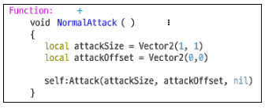

# 5주차

  

 
# Resources

 
### 컴포넌트의 활용 I
- MOD에서 자주 사용하는 컴포넌트 실습
- dafault player (캐릭터)
<ol>

- RigidBodyComponent:캐릭터의 움직임  
하향점프  
중력값   
isblockvirtical: 다른 지형의 발판정보에 막히는것  
IsolatedMove: 낭떨어지에서 막혀서 못떨어지게 함  
MASS: 질량, 질량이 클수록 보존하는 힘이 커져서 가속이 늦게붙음  
IsQuarterView: 게임의 방식을 위아래 구분없이 수평,수직으로 구분함
- TriggerComponent: 물체의 충돌  
Enter: 충돌시, Stay:출돌하는 동안, Leave: 충돌이 끝났을때  
self.entity.enable = false 아이템을 먹은것처럼 하는것 (사라지게함)
- SpriteRendererCompoennt: 대표적인 display Component. Sprite가 아닌 비슷한 것을 수행하는 component가 존재한다. 
- WebSpriteComponent: 웹에 있는 이미지를 경로를 따와서 가져올 수 있다. 애니메이션도 설정 가능
- YoutubeComponent: 유튜브의 주소를 가져오면, 해당 영상을 스트리밍 해준다.
- AvatarRendererComponent, CostumeManagerComponent: 캐릭터의 옷,피부, 등을 설정할 수 있는 Component

</ol>

### 컴포넌트의 활용 II
- keydownEvent: 키가 눌렸을때 발생하는 이벤트
- TouchEvent Component: Entity를 터치했을시 발생하는 Component
- ScreenTouchEvent Component: 모바일에서 화면을 터치했을때 발생하는 Component
- chatBaloon Component: 말풍선 Component
- PlayEffect: keydown 등 이벤트가 발생했을시, 이벤트를 발생시킨다. 이펙트의 RUID, 적용대상, 위치, z값, 크기
- PlayEffectAttatched: 이벤트가 Entity를 따라가게하는 것. + 파라미터로 부모엔티티가 필요함
- local direction = self.Entity.PlayerControllerComponent.LookDirectionX: 엔티티가 바라보는 방향에따라 왼쪽이면 음수, 오른쪽이면 양수값이 들어감
- SoundComponent: 사운드를 설정하는 Component
- CameraComponent: 카메라 조정하는 Component
- _TeleportService: Entity를 텔레포트시켜주는 서비스

  
  

# Docs
 
 

## ch09

### 엔티티의 충돌을 감지하는 TriggerComponent
- 2주차 내용과 동일
### 원하는 이미지 갖고 오기
- 게임에 필요한 이미지 리소스를 찾아 메이커에 활용한다.
- 이미지 가져오기: Workspace - MyDesk - Import from - Import Image 에서 가져온다.
- 이미지 활용방식  
1. Workspace - MyDesk - Place To Scene Maker
2. Workspace - MyDesk - 이미지 드래그 앤 드롭
3. Workspace - NativeModel 에서 필요한 모델을 Scene에 배치, Sprite RUID/Image RUID를 변경

  

## ch10

### InputService를 활용한 입력과 액션
- 모든 게임은 유저의 입력과 입력의 피드백으로 게임이 진행된다.  유저가 키를 입력하거나 터치했을 때, 그리고 특정 엔티티를 누르거나 터치했을 때 액션을 추가하는 방법에 대해 알아보도록 하겠습니다.
- 이벤트 핸들러의 추가와 설정
<ol>

- 스크립트 생성 후, Entity Event Handler에서 + 를 눌러 이벤트를 추가한다.
- KeyDownEvent: 눌리지 않은 상태에서 눌렸을때 1회 발생
- KeyUpEvent: 키가 눌려있는 상태에서 손을 떼었을때 1회 발생
- KeyHodEvent: 키가 눌려있는 동안 프레임마다 발생
- KeyReleaseEvent: 키가 Hold 상태에 있다가 키에서 손을 떼었을때 1회 발생. KeyUP과 비슷하지만, 키가 한 프레임이라도 Hold 되어 있던 상태에서 Release 상태가 되었을 때 액션을 추가하고 싶다면 HandleKeyReleaseEvent 사용.
- ScreenTouch***도 같은 매커니즘
</ol>

### 공격과 피격
- 공격에 대한 구현: 공격은 "캐릭터로 Ctrl 버튼을 눌렀을 경우 발동하는 Attack 상태로 정의"
<ol>

- 박스 생성 방식  
Attack()과 AttackFrom() 두 가지 방식으로 박스 생성  
Attack()은 캐릭터 위치 기준으로, AttackFrom()은 맵 포지션을 참고해 박스를 생성.
Attack() 의 박스 생성  
%EB%B0%95%EC%8A%A4%20%EC%83%9D%EC%84%B1.PNG)  
AttackFrom()의 박스 생성  
%20%EB%B0%95%EC%8A%A4%20%EC%83%9D%EC%84%B1.PNG)
- 만약 공격 박스 안에 HitComponent를 가지고 있는 엔티티가 있다면 Hit처리 대상. 추가정보는 AttackComponent를 참고한다.

- Attack 컴포넌트를 이용해 공격 구현.
1. 워크스페이스 검색창에 AttackComponent 입력. AttackComponent에서 마우스 우클릭 후 Extend를 클릭하여 AttackComponent의 확장 컴포넌트를 생성합니다.
2. 컴포넌트의 이름은 CharacterAttack을 사용.
3. 플레이어의 행동 변화를 받을 PlayerActionEvent의 핸들러를 추가하고 다음과 같이 작성한다.  

4. 이 컴포넌트가 삽입된 플레이어는 액션이 Attack이 될 때마다 NormalAttack() 함수를 호출한다.
5. 새로운 NormalAttack 함수 추가가 필요하다. Function의 우측 +버튼을 눌러 New 타입의 새로운 함수를 추가하고, NormalAttack 함수 아래 내용을 추가하여 공격 박스를 생성한다. 박스의 크기와 위치는 Vector2 타입을 사용합니다.
attackOffset은 캐릭터를 중심으로 떨어진 거리를 의미함으로 위 예시에서는 생성 위치는 캐릭터의 중심입니다. 이후 Attack 함수를 호출하고 인자값으로 공격 박스의 크기와 위치, nil 값을 전달하고 있습니다. nil값 전달은 선택사항으로 피격자에게 전달하고 싶은 추가 값이 있다면 3번째 인자 값으로 넣으면 됩니다.  
  
5. 이제 공격 박스가 정상적으로 생성되는지 확인하겠습니다.
가장 확실한 방법은 타격한 대상에게 데미지를 출력하는 것입니다.
Method 우측의 AddPropertyFunction 버튼을 눌러 함수 목록에서 CalcDamage 를 선택합니다. CalcDamage 함수는 충돌 시 발생하는 데미지를 반환하는 함수입니다.
CalcDamage 함수는 충돌 시 발생하는 데미지를 반환하는 함수입니다.
데미지를 연산할 때 공격자의 공격력과 피격자의 방어력을 비교하는 등의 과정이 있기 때문에 인자값으로 공격자인 attacker entity, 피격자인 defender entity 정보를 가지고 있습니다.
만약 Attack 함수 호출 시 3번째 인자에 테이블을 전달했다면 attackInfo 인자값을 통해 이를 참고할 수 있습니다.
다만 이번 과정에서는 전투 공식을 사용할 것이 아니므로 기존 문구를 지우고 간단하게 1000의 값을 리턴해 주도록 합니다.  

6. 워크스페이스에서 DefaultPlayer 안에 CharacterAttack 컴포넌트 추가.
7. 공격받을 피격자 엔티티를 배치 한다. (몬스터는 기본적으로 Hit 컴포넌트를 가지고 있다. 만약 몬스터가 아닌 다른 엔티티에 공격을 해야한다면, Hit 컴포넌트를 추가한다.)  
단 위 예시에서 공격 대상을 선정하는 과정은 생략하고 있습니다.
플레이어 캐릭터도 Hit 박스를 가지고 있는 엔티티입니다.
따라서 본래라면 위 과정에서 공격 박스를 생성하면 플레이어도 데미지를 입어야 합니다.

타겟을 선정하는 함수인 IsAttackTarget은 공격자가 공격박스에 포함되지 않도록 내부적으로 처리하고 있습니다.
앞서 제작한 PlayerAttack 컴포넌트에서 함수 추가 버튼을 누르면 함수 리스트에서 IsAttackTarget 을 확인할 수 있습니다.
IsAttackTarget 함수의 역할은 충돌한 엔티티를 실제 공격해야 하는 대상인지 판단하기 위한 함수입니다.
이를 식별하기 위해 인자값으로 충돌한 엔티티 정보를 받습니다.  
  
IsAttackTarget의 리턴 값이 false인 경우 충돌로 인한 후속 이벤트는 발생하지 않으며 true이면 무조건 발생합니다. 만약 PlayerAttack 컴포넌트에 IsAttackTarget 함수의 리턴 값을 true 로 변경한다면 플레이어가 자신의 공격에 데미지를 입는 상황이 발생합니다. 반대로 기본값을 그대로 가진다면 Attack 컴포넌트에서는 적합한 공격 대상으로 판별하고 이후 판단을 Hit 컴포넌트에 넘기며 자신의 역할을 끝냅니다.
</ol>
- 공격과 피격  
Attack 컴포넌트는 반드시 피격을 위한 Hit 컴포넌트가 있어야한다.
충돌을 발생했다 하더라도 명중 여부는 분리해서 판단한다.  
예를 들어 플레이어가 슬라임을 공격할 때 명중시키는 경우와 헛치는 경우가 있습니다. 여기서 명중에 실패한 케이스라면 공격자의 IsAttackTarget에서 false를 반환하고 더 이상의 절차를 생략한다.  
명중에 성공했다면 기본 리턴 값을 그대로 사용하요 피격자의 IsHitTarget에 나머지 역할을 맡긴다. 하지만 절대 명중 개념을 사용하고자 한다면 공격자의 IsAttackTarget을 true로 반환한다. 이의 경우 피격자의 IsHitTarget은 호출되지 않고 무조건 데미지를 입히는 절차로 진행한다.  
공격자의 ISAttackTarget을 true로 반환했거나 피격자의 IsHitTarget이 ture를 반환하면 데미지를 피격자에게 적용한다.  
먼저 공격자 입장에서 CalcDamage함수를 이용해 적용하고자 하는 데미지 반환. 피격자의 OnHit 함수는 이 데미지를 인자값으로 전달받아 변환할 수 있다. 예를 들어 공격자의 공격력을 참고한 데미지가 전달됐지만 방어자의 물리 방어력 등을 적용해서 차감시키는 상황.  
이 모든 과정이 완료되고 OnHit함수의 리턴값이 최종 데미지.
OnHit 함수는 호출될 시 HitEvent를 발생.
업적 등을 구현할 때 이 이벤트 발생을 체크하여 별도의 업적 컴포넌트에서 구현하는 것이 더 효율적이다.
- 피격에 대한 구현.
<ol>

- Hit 컴포넌트를 확장한 MonsterHit 컴포넌트 제작.  
이미 Hit 컴포넌트로 피격처리가 가능하지만, 아래 두 가지 요소 추가.  
1. 전달받은 데미지를 1로 변경
2. 공격을 받을 때마다 사이즈가 커진다.
- 확장한 HitComponent를 사용해야 하므로, 피격 대상으로 몬스터를 이용하면 기존 Hit컴포넌트를 삭제후 확장 HitComponent를 사용한다.
- MonsterHit 컴포넌트 제작.
1. 워크스페이스에 HitComponent Extend 생성. 컴포넌트의 이름은 MonsterHit 으로 사용하고 스크립트 에디터를 연다.
2. Function 우측 + 버튼을 눌러 OnHit 함수 추가.  
함수 내 기본 작성된 문구 중 damage 값을 1로 변경, 피격당한 몬스터의 사이즈가 커지는 부분에서 scale을 늘려 사이즈가 커지게 한다.  

</ol>

### 스킬 이펙트를 뿌려보자!
- EffectService
- PlayEffect (string animationClipRUID, Entity instigator, Vector3 position, number zRotation, Vector3 scale, boolean isLoop = False)  
이펙트를 고정된 특정 위치에 원하는 크기로 호출할 수 있습니다.  
animationClipRUID : 호출하려는 이펙트 리소스의 RUID 입니다.  
instigator : 맵 정보를 받아오기 위한 엔티티로, 이펙트가 호출될 맵과 동일한 맵에 존재하는 엔티티를 넣어줍니다.  
position : 이펙트가 호출될 위치 벡터를 입력합니다.  
zRotation : 회전 값을 넣어줍니다. 회전시키지 않으면 0을 넣어줍니다.  
scale : 호출될 이펙트의 크기 벡터값을 넣어줍니다. 기본적으로는 Vector3(1, 1, 1)을 넣어줍니다.  
isLoop : true로 넣어주면 이펙트가 무한으로 재생되고 false로 넣으면 이펙트가 한 번 재생됩니다.  
- PlayEffectAttached(string animationClipRUID, Entity parentEntity, Vector3 localPosition, number localZRotation, Vector3 localScale, boolean isLoop = False)  
PlayEffect와 같이 이펙트를 호출하지만, 호출될 이펙트의 부모 엔티티를 선정하고 부모의 위치를 기준으로 호출될 위치를 설정합니다.  
animationClipRUID : 호출하려는 이펙트 리소스의 RUID 입니다.  
parentEntity : 호출될 이펙트의 부모가 될 엔티티를 넣어줍니다. 호출된 이펙트는 해당 엔티티의 자식으로 생성됩니다.  
osition : 부모 엔티티의 position을 기준으로 얼마만큼 떨어진 곳에서 호출할 것인지에 대한 위치 벡터값을 넣어줍니다.
기본적으로 Vector3(0,0,0)을 넣어주면 부모 엔티티와 같은 위치에 이펙트가 생성됩니다.  
localZRotation : 부모 엔티티의 회전값을 기준으로 얼마나 더 회전할 것인가를 입력합니다.  
localScale : 호출될 이펙트의 크기 벡터값을 넣어줍니다. 기본적으로는 Vector3(1, 1, 1)을 넣어줍니다.  
isLoop : true로 넣어주면 이펙트가 무한으로 재생되고 false로 넣으면 이펙트가 한 번 재생됩니다.  

