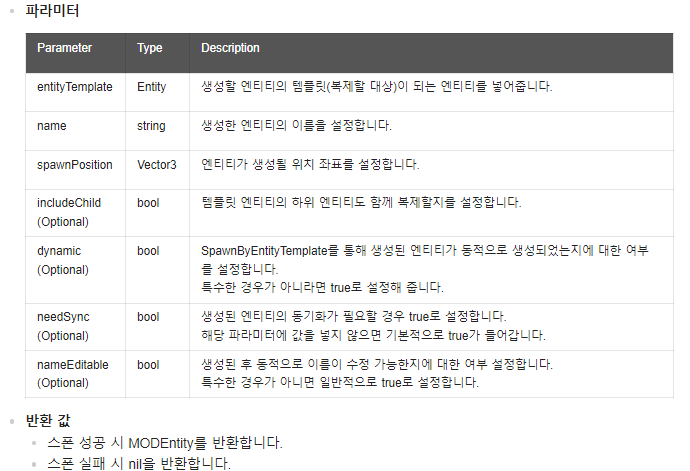
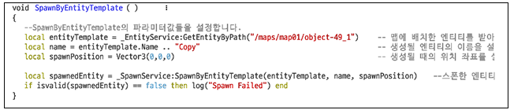
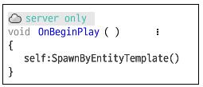
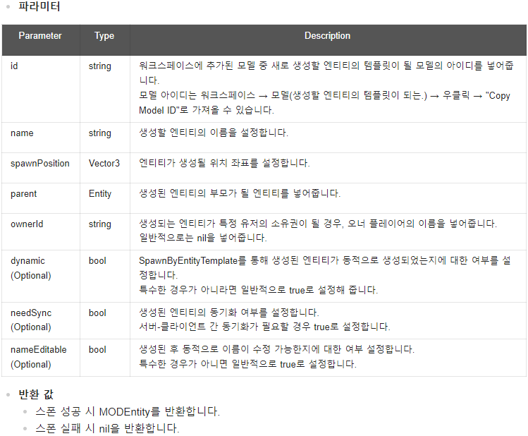
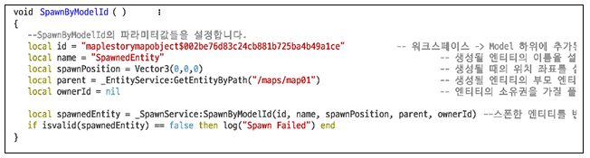

# 4주차

  

 
# Resources

 
## Event와 컴포넌트 확장
- Event란 어떤 객체와 객체간의 주고받는 형식 
- MOD에서는 Entity Event System을 지원한다.
- Entity는 다수의 Component를 지니고있고, 이 component들로 제어를 합니다.
- 자신의 Entity안의 컴포넌트 접근, Entity간 컴포넌트 접근
- Entity Event Modler 에서는 여러 이벤트가 발생했을때 처리할 수 있음.
- Script에서 Script로 이벤트 쏘기
- Native에서 Script로 이벤트 쏘기
- Native-> Script 예시  
HandleKeyDownEvent, HandleFootholdCollisionEvent, HandleTouchEvent, HandleScreenTouchEvent
- Script에서도 Native쪽으로 이벤트를 쏠 수 있다.
- Native Component와 Script Component가 분리되어있고, 그것을 연결하는게 Event도 있지만, 다른 하나가 더 있다.
- Component 확장
<ol>

+ 기존 Component 우클릭 -> Extend(확장)
+ 이것은 기존 Component에서 확장한 형태를 가진다.  
이것은 기존 Component가 가지고 있는 모든 Property를 다 가진 상태로, 추가적으로 붙여서 확장 처리를 할 수 있다.
+ ovveridable 함수를 이용해서 구현하게 되면, 원래 있는 함수 대신에, 내가 바꾼 함수를 실행하게 할 수 있다.
</ol>

  
  

# Docs
 
 

## ch08

### Event System
- 로직을 작성하다 보면 어떤 상태가 변하거나 어떤 액션이 있거나 특정 일이 주어졌을 때, 즉 특정 타이밍에 "무언가를" 해야 할 일이 생깁니다.  
그럴 경우 "행위가 일어난 주체"에서 무얼 할 것인지 결정합니다.
- 게임 내에 캐릭터가 공격받는 상황
<ol>

1. HP를 깎고
2. 데미지 스킨을 띄우고
3. 잠깐 무적으로 만들어줍니다.  
이런 요구사항이 있을 때 공격받으면 각각의 부분에서 각각의 기능의 함수를 불러 주면 됩니다.
내 캐릭터가 공격받으면 HP를 깎고, 데미지를 띄우고, 무적으로 만들어 줄 수 있습니다.
그런데 좀 지나고 보니 피격 효과에 특별한 이펙트를 주고 싶어졌습니다.  
4. 타격 이펙트를 표시한다. 를 추가한다.
+ 이벤트 시스템과 일반 로직의 차이는 "행위가 일어난 주체"에서 일을 처리할 것인지, "행동을 실행해야 할 주체"에서 일을 처리할 것인지에 대한 차이 
</ol>

- Event System의 구성
<ol>

1. Event: 로직 상에서 어떤 사건의 발생을 의미한다.
2. Handler: 해당 Event를 받았을 때 처리하는 행동의 주체. 해당 이벤트가 불렀을 때 불리는 함수라고 생각하면 된다. (listtener, subscriber 등의 비슷한 용어가 있다.)
3. Sender: 해당 Event를 발송하는 객체. (emmiter, dispatcher 등의 비슷한 용어가 있다.)
+ 학급 전체에 공지문을 우편 배달한다고 가정한다. 이때 Event는 공지문, Handler는 학급 내 학생들, Sender는 우편 배달원이 된다.
</ol>

- Event System의 장단점
<ol>

+ 장점  
다른 Component 나 기능단위에서 결합성이 떨어지므로 의존성을 배제할 수 있고 분산시스템이 용이 해집니다.  
행위에 대한 액션을 추가 하고 싶을 때 행위를 수행하는 곳을 수정 없이 편하게 추가할 수 있습니다.  
다른 Component의 정보를 알 필요가 없습니다.
+ 단점
어떤 사건이 발생 시 전체적인 플로우를 찾기가 힘듭니다. 각각 처리 하므로 실행되는 시점에서는 알 수 없기 때문이죠  
위와 같은 이유로 디버깅이 힘들 수 있습니다.  
또한 순차적인 행위를 하기에 어려움이 있습니다. A → B → C→ D의 순으로 진행돼야 한다면 이벤트 시스템만으로는 힘이 듭니다.
</ol>

### Entity Event System
- Event System의 기본으로 제공되는 API를 사용하여 "Vampire vs Hunter"의 게임 요소중 하나를 구현하기. 
- EntityEventSystem: 이벤트를 보내고 받는 방법에 대해서 먼저 알기 위해서는 Entity Event System을 이해해야 합니다.  
Component는 Entity를 중계자로 사용할 수 있습니다.  
<ol>

각각의 Component는 Entity를 통해 핸들러를 등록하고, 이벤트 발생도 Entity를 통해 할 수 있습니다.  

- Component 들이 Entity에 핸들러를 등록하고 Sender 역시 Entity를 통해서 이벤트를 발생할 수 있습니다.
Entity 들은 핸들러들에게 해당 Event를 전송하게 됩니다.
+ 기본적으로는 자기 자신의 Entity에 연결하는 경우가 대부분이지만,
아래 그림처럼 상황에 따라 다른 Entity로 연결하는 것도 가능합니다.
특히, Map Entity와 World Entity는 서로 간에 Event를 주고받는 경우가 많아 자주 사용됩니다.
</ol>

- Sunrise Event 생성  
Event 시스템에는 기본적으로 제공하는 Native 형 Event 들이 있습니다.  
Event 들은 Listen 하거나 이벤트를 발생 시킬 수 있습니다. 추가로 직접 Event Type을 선언 할 수도 있습니다.  
Workspace에서 새로운 Event Type을 선언하거나 Import 할 수 있습니다.
<ol>

+ 새로운 Event Type을 선언하거나 Import 방법
+ Workspace에서 우클릭하고 팝업창이 나타나면 Create EventType을 선택합니다.  

+ 해당 Property 안에 boolean Type인 isSunrise를 사용하여, 해가 뜨고 지는 상태를 True/False로 체크한다.
+ 등장하는 Vampire와 Hunter 들은 평소에는 일반적인 전투와 움직임을 하다가, SunriseEvent를 받게 됩니다.  
Sunrise 상태일 때, Hunter는 따스한 햇볕으로 Hp를 회복하고 Vampire는 Hp가 감소하게 만드는 게 목표입니다.  
Sunrise 상태일 때의 로직을 구현하기 위해 다음과 같이 워크스페이스에서 VampireComponent와 HunterComponent를 추가해 줍니다.  

</ol>

- 핸들러 로직
<ol>

위에서 만들었던 SunriseEvent를 통해, 헌터와 뱀파이어 Entity에 넣어줄 HunterComponent, VampireComponent 를 제작해보겠습니다.  
우선 두 컴포넌트 모두 SunriseEvent를 받을 수 있도록 해야 합니다.  
+ 두 컴포넌트의 스크립트 에디터에서 Entity Event Handler에서 +버튼을 누르고, SunriseEvent를 선택하여 이벤트 핸들러를 추가해 줍니다.  

+ SunriseEvent는 map에 의해 발생되므로 중계 Entity를 map01으로 설정해야 합니다.
다음과 같이 핸들러 상단의 이벤트 중계자를 map01로 설정해 줍니다.  

+ Handler 추가 작업이 완료되었으면, 이제부터 SunriseEvent 를 받을 수 있습니다.  
이제는 각자 받은 SunriseEvent를 처리하는 로직을 넣어야 합니다.  
Hunter의 경우에는 Hp 회복 로직을, Vampire의 경우에는 Hp 감소 로직을 넣어줍니다.  
먼저, 해가 뜨면 Hp가 증가하는 HunterComponent 예제입니다.  
  
해가 뜨면 Hp가 감소하는 VampireComponent 예제  

+ 스크립트 작성 완료 후, Vampire 엔티티와 Hunter 엔티티를 선택한 후 Property Editor에서 Hp값을 100으로 설정.
</ol>

- 이벤트 발생 로직
<ol>

+ 해가 뜨고 지는 로직을 만들어줄 차례입니다. 특정 시간마다 해가 뜨고 지게 만드는 게 목표입니다.  
해에 대한 시간을 관리해 줄 TimeManger Component를 새로 제작합니다.  
TimeManager Component를 Map Entity에 넣어주면 해당 Map에서 시간을 관리해 줄 것입니다.  
+ TimeManager에 OnUpdate Method를 통해서 해가 뜨고 짐을 판단할 수 있게 합니다.  
하단에는 이벤트 발생 Method도 추가하여 SunriseEvent를 발생시킬 수 있게 합니다.
아래는 예제입니다.  

+ 완성된 Component를 map01 엔티티에 AddComponent 시켜준다.
+ 덧붙여서, Hunter 궁극기로 태양을 뜨게 하는 일출 스킬을 제작해 보겠습니다.
Z 키를 이용해 이벤트를 호출하기로 합니다.
아래는 HunterComponent에 HandleKeyDownEvent 추가한 결과입니다.  

+ 이제 Z 키를 눌러 해가 뜨게 만들 수 있습니다.
</ol>

### 엔티티의 생성과 삭제, 유효성 체크
- 게임을 제작하면서 엔티티의 생성과 삭제는 가장 많이 사용되는 기능 중 하나입니다.  
MOD에서는 _SpawnService와 _EntityService 등을 통해 엔티티를 생성하고 제거하는 여러 기능들을 제공하고 있습니다.  
이번 과정에서는 엔티티를 생성하는 기능들과 삭제 방법, 그리고 엔티티가 존재하는지에 대한 여부를 알 수 있는 유효성 체크 기능에 대해 알아봅니다.
- 엔티티 생성: MOD에서는 "_SpawnService"라는 서비스를 통해 여러 엔티티 생성 함수를 제공하고 있습니다.  
이번  과정에서는 주요 엔티티 생성 함수인 SpawnByEntityTemplate과 SpawnByModelId에 대해 알아보겠습니다.
- SpawnByEntityTemplate
<ol>

+ 배치된 엔티티와 동일한 엔티티를 생성합니다.
+ 엔티티의 "복제" 의미이다.
+ 따라서 맵 상에 "복제" 대상이 되는 템플릿 엔티티가 반드시 존재해야 한다.
+ 파라미터와 반환 값  

+ 사용 예시
<ol>

+ 템플릿이 될 엔티티를 맵에 배치한다.
+ WorkSpace에서 SpawnManager라는 이름으로 컴포넌트를 하나 생성한다.
+ "SpawnManager"를 더블클릭하여 스크립트 에디터를 열고, "SpawnByEntityTemplate"라는 이름의 New 함수를 생성한다.  

+ 작성이 완료되었으면, 'OnBeginPlay'를 추가하고 스크립트를 작성한다.  

+ 작성이 완료된 컴포넌트를 Scene Maker-> world->Common에 추가해준다.
</ol>
</ol>

- SpawnByModelld
<ol>

+ 워크스페이스에 추가된 모델들 중 한 가지 모델을 지정하여 엔티티로 생성합니다.  
모델 리스트에서 우클릭 → Add to workspace 를 통해 워크 스페이스로 모델을 추가합니다.
대체로 모델 리스트에 있는 모델을 엔티티로 생성하고자 할 때 사용됩니다.
+ 파라미터와 반환 값  

+ 사용 예시
<ol>

+ 좌측 모델 리스트에서 원하는 모델 우클릭 → Add to workspace를 해서, 모델을 워크스페이스에 추가해 줍니다.
+ 우측 워크스페이스에서 해당 모델 우클릭 -> Copy Model ID로 모델의 ID를 복사
+ 위에서 만들었던 SpawnManager 컴포넌트를 열고, "SpawnByModelld"라는 이름으로 함수 생성
+ 스크립트 작성 (ID 복사해올때 "model://"은 제거한다.)  

+ 작성이 완료되었으면, 위에 추가한 'OnBeginPlay'를 다음과 같이 수정한다.  

</ol>
</ol>

- 엔티티 제거: 엔티티를 제거하는 _EntityService:Destroy와 Entity:Destroy 두가지가 있다.
- _EntityService:Destroy는 인자로 넘겨받은 엔티티를, 그리고 Entity:Destroy는 Destroy를 호출한 Entity 자신을 삭제한다.
- 따라서 두 함수는 삭제 대상의 차이만 있을 뿐 삭제 동작은 동일하다.
- 엔티티 제거 파라미터  

- _EntityService:Destroy & Entity:Destroy 사용 예시
<ol>

+ _EntityService:Destroy 사용
<ol>

+ 프로퍼티 하나 추가하고, 타입과 이름을 다음과 같이 설정.  
any SpawnedEntity = nill
+ SpawnByModelld 함수를 다음과 같이 수정한다.  
_SpawnService:SpawnByModelId반환 값을 지역변수 spawnedEntity가 아닌 프로퍼티 SpawnedEntity에 참조시킵니다.  

+ OnUpdate 함수를 추가하고, 다음과 같이 작성한다. (엔티티가 생성된 후 3초 후 해당 엔티티를 삭제하는 스크립트 추가)  

</ol>

+ Entity:Destroy 사용
<ol>

</ol>
</ol>

- 엔티티 유효성 체크
<ol>

+ 엔티티 생성과 삭제 시, 생성된 또는 삭제된 엔티티의 상태를 체크하게 됩니다.
이럴 때 보통 엔티티의 nil 체크를 하게 되는데, 삭제 대기 중 같은 상태에서는 원하는 값을 제대로 얻지 못하는 경우가 종종 있습니다.  
그래서 이럴 때 사용하는 것이 엔티티 유효성 체크 기능으로 MOD에서는 엔티티의 nil 체크 대신 유효성 체크를 권장하고 있습니다.  
유효성 체크는 글로벌 함수인 isvalid를 통해서 할 수 있습니다.  
isvalid는 엔티티의 nil 체크와 더불어 현재 삭제 대기 중인지 또는 삭제되었는지를 확인하여 true 또는 false 값을 반환합니다.
+ isvalid  
+ 파라미터와 반환 값  

+ 사용 예시
<ol>

+ SpawnManager의 OnUpdate 함수를 다음과 같이 수정한다.  

+ 유효성 체크는 글로벌 함수인 isvalid를 주로 이용하지만, _EntityService에서도 동일한 기능의 함수를 제공하고 있습니다.  
바로 _EntityService:IsValid(entity) 인데요, 대소문자만 조금 다를 뿐 isvalid와 동일한 기능을 수행하는 함수 입니다.  
따라서 위 스크립트를 아래와 같이 수정해도 동일한 결과를 얻을 수 있습니다.  

</ol>
</ol>

